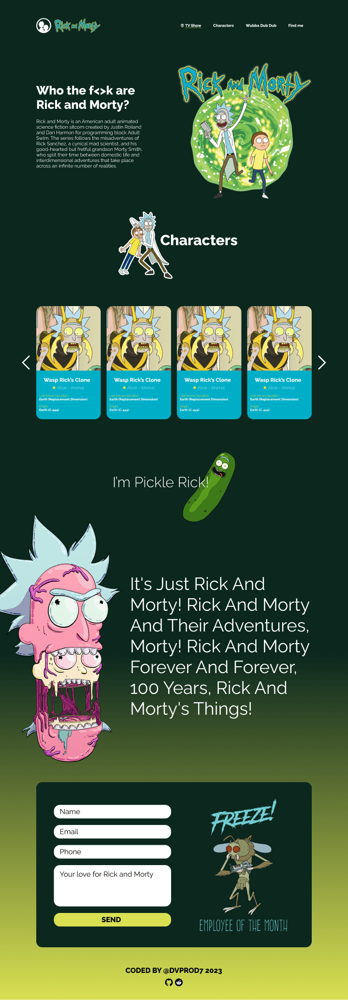

# Rick and Morty Landing Page API
A quick example for use Rick And Morty API in vanilla js. This projects was coded:
- 💻Simple HTML5 and Bootstrap as helper for the styling and layout.
- 🎨 Sass to make fast styling
- 🧠 Vanilla JS to create custom functions and calls for the API.
## Landing page screenshot  
  
